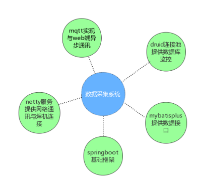
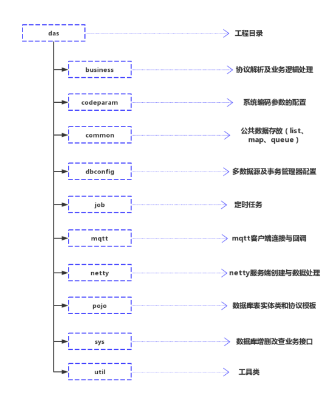
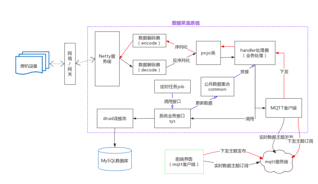
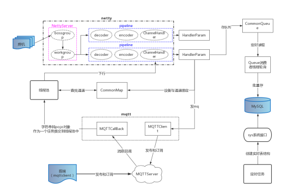

# 数据采集系统解析文档

## 1.准备环境和工具

#### A.JDK 11、MySQL 5.7

#### B.数据库：weldmesdb、weldmes-rtdata、mongodb

#### C.消息队列服务端：EMQ

#### D.开发工具 IntelliJ IDEA

## 2.Gitee地址

https://gitee.com/zhushanlong/jnzc_weldmes_cloud.git

## 3.系统架构构成

## 4.项目结构说明

## 5.端口

#### Netty服务端（OTC）：5555

#### Netty服务端（松下）：9002

#### Das：9090

#### Mqtt服务端：1883

## 6.数据走向流程图

## 7.流程图

## 8.监控

#### (1)druid监控台：http://localhost:9090/druid/login.html

#### (2)EMQ监控台：http://localhost:18083/#/login

#### (3)SpringBootAdmin监控台：http://localhost:9090

## 9.打包部署

#### (1)Idea右侧工具栏maven ----> das ----> Lifecycle ----> clean 、compile 、package （BUILD SUCCESS 为打包成功）

#### (2)项目根目录下的target文件下的das.jar

#### (3)CMD命令窗口，cd 到 das的target目录下，

启动命令：java -jar das.jar

## 10.功能

#### (1)多数据源配置（数据库连接地址及对应账号密码）

#### (2)MQTT消息队列客户端参数配置

#### (3)NETTY服务端端口配置

#### (4)OTC、松下系统功能是否启用（默认：启用），可配置

#### (5)待机数据是否存储（默认：不存储），可配置

#### (6)每天7点清除任务绑定信息（时间可配置）

#### (7)刷卡启用设备功能，可配置（默认：启用）

#### (8)点对点工艺下发，多线程并发下发

#### (9)实时数据的分表策略和建表执行时间，须指定具体的策略（默认：按天分表）

#### (10) OTC焊机锁定或解锁失败后重试机制（默认：最多3次）

#### (11) ProcessDb数据库是否启用配置，连接配置，库名、表名配置。

#### (12) SLF4J日志门面+logback日志实现配置

#### (13) 开机启动任务：

①创建OTC、松下当天实时表结构 ②启动OTC、松下等设备开机、关机队列的消费者线程。 ③启动松下新增设备的存储队列的消费者线程。

#### (14) 定时任务：

A.每天23点创建第二天实时表结构（OTC+松下） B.每隔10分钟更新OTC设备的采集模块、焊机数据信息 C.每隔整点执行实时数据统计（OTC+松下） D.每隔10分钟对OTC设备进行时间校准
E.每隔3秒对OTC、松下的实时数据队列进行批量存储（OTC+松下）

## 11.通讯协议

#### (1)OTC 1.0（江南项目、西安项目）

a.实时数据 b.工艺下发 c.工艺下发返回 d.工艺索取 e.工艺索取返回 f. 密码下发 g.密码下发返回 h.控制命令下发 i.控制命令下发返回 j.时间 校准

#### (2)OTC 2.0（哈电机项目）

a.实时数据 b.工艺下发 c.工艺下发返回 d.工艺索取 e.工艺索取返回 f. 密码下发 g.密码下发返回 h.控制命令下发 i.控制命令下发返回 j.时间 校准 k.更新程序下行 l.索取程序上行 m.下发程序 n.更新程序完成上行
o. 上传信号强度 p.上传位置坐标 q.下发卡号白名单 r.确认收到卡号白 名 单 s.任务结束下行 t.确认收到任务结束上行

#### (3)OTC 3.0

#### (4)松下（江南项目）

#### GL5 + FR2 + AT3：

##### a.第一次握手验证 b.第二次握手验证

#### GL5:

##### 上行：

a.实时信息(co2)  b.状态信息(co2)  c.工艺参数设定回复 d.工艺参数读取回复(有数据[co2+tig]、无数据)  e.工艺参数删除回复 f.焊接通道设定回复(锁定或解锁)  g.焊接通道读取回复 h.软硬件参数信息
i.心跳信息

##### 下行：

a.工艺参数设定(co2+tig)  b.工艺参数读取 c.工艺参数删除 d.焊接通道设定(锁定或解锁)  e.焊接通道读取

#### FR2:

##### 无机器人(上行)：a.实时信息(co2+tig)  b.状态信息(co2+tig)

##### 下传:  a.查询参数 b.查询参数回复(有参数、无参数)  c.下载参数 d.下载参数回复 e.删除通道 f.删除通道回复

#### AT3:

##### 下传:  a.查询参数 b.查询参数回复(有参数、无参数)  c.下载参数 d.下载参数回复 e.删除通道 g.删除回复
